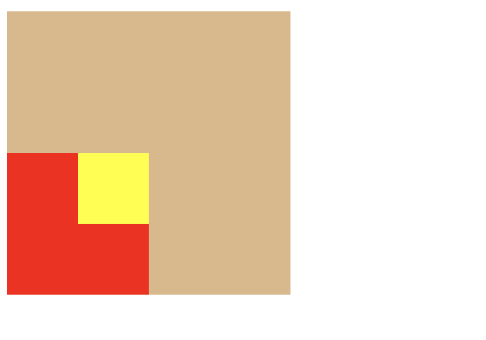
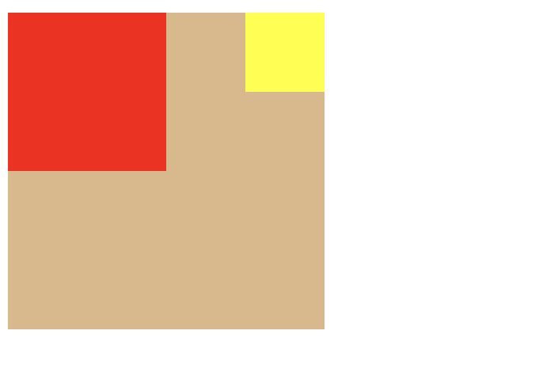

在很多课程上，甚至在开发中的了解，我收集到的信息都是，要让子元素的绝对定位生效，必须把父元素设置为相对定位，这个听起来也很讲道理，所以在后面的实践中我也都是如此做的，直到我碰到了这个场景：

最外层父元素的定位为position:relative;里面的子元素定位为position:absolute;最里面的孙元素也是绝对定位(absolute)且top值为0,那么按照平时的所学，孙元素必定按照最外层父元素来定位，那么top:0;孙元素的上边应该和最外层父元素的上边重合，但它明显并没有如此，这是为什么呢？？？此时我开始了思考，那么它既然没有上去，也就是说，孙元素是参照子元素的定位的，接着，我修改了孙元素的right:0;果不其然，但这背后的原理是啥呢？说好的父元素必须relative呢？看来一定有我不知道的知识再等待着我。
将问题定位到未知领域后，我进行了搜索查阅，最终找到了新的知识点。

## Containing Block(包含块模型)
什么是包含块模型呢？官方定义如下：
> The size and position of an element are often impacted by its containing block. Most often, the containing block is the content area of an element's nearest block-level ancestor, but this is not always the case. In this article, we examine the factors that determine an element's containing block.  

什么意思呢？简单说就是，一个元素的尺寸和位置会受其包含块的影响。大多数情况下，包含块就是这个元素最近的祖先块元素的内容区。

### 内容区？
内容区就是经典盒模型，最里层的就是内容区了

## 确定元素包含块
我之前认为一个元素的包含块就是其父元素的内容区。但明显事情没有这么简单。  
确定一个元素的包含块的过程完全依赖于这个元素的position属性：

- 如果position属性为 **static** 或 **relative** ，包含块就是由它的最近的祖先块元素（比如说inline-block, block 或 list-item元素）或格式化上下文(table,flex,grid)的内容区的边缘组成的。
- 如果position属性为**absolute**，包含块就是它最近的position的值不是 **static**的元素的内边距区的边缘组成。(fixed, absolute, relative 或 [sticky](https://www.qianduan.net/position-sticky-introduction/)
- 如果position属性是**fixed**，在连续媒体的情况下(continuous media)包含块是 viewport(视口) ,在分页媒体(paged media)下的情况下包含块是分页区域(page area)
- 如果position属性是**absolute**或**fixed**，包含块也可能是由满足以下条件的最近父级元素的内边距区的边缘组成的：
    - transform或perspective不为none
    - 将改变transform或perspective的值
    - contain的值为paint

## 根据包含块计算百分值
包含块还是计算元素的百分比值的参照物：
- 计算height、top、bottom的百分比值，要通过包含块的height的值，**但，如果包含块的 height 值会根据它的内容变化，而且包含块的 position 属性的值被赋予 relative 或 static ，那么，这些值的计算值为0**
- 计算width,left,right,padding, margin 这些属性由包含块的 width 属性的值来计算它的百分值。

## 解决问题
想要孙元素参照最外层父元素定位，直接把子元素的positin给删掉即可，默认就是static

完美！