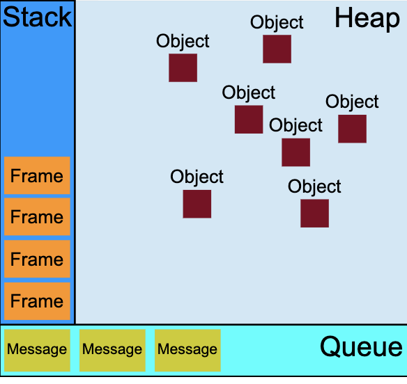

## 引
先来看一手题目：
```js
console.log(1)
setTimeout(_=>{
console.log(2)
},0)
console.log(3)
```

当我看到这个题目时，觉得它能出现在题目中，绝对不是1，2，3那么简单。虽然把答案蒙对了(1,3,2)，但是为什么还不太清楚。当然这是小聪明的做法，那么现在就来探索下背后的知识点把。

## 执行栈与事件队列
当Js代码执行的时候会将不同的变量存于内存中的不同位置：堆（heap）和栈（stack）中来加以区分。其中，堆里存放着一些对象。而栈中则存放着一些基础类型变量以及对象的指针。 但是这里我们说的执行栈和上面这个栈的意义却有些不同。   
### 可视化描述

### 栈
函数调用会形成一个由若干帧组成的栈，即先调用帧被压入栈，接着第二个调用帧再被压入栈，随后第二个函数执行完后返回时，第二个帧会被弹出栈，接着第一帧也被弹出
### 堆
对象被分配在堆中，堆是一个用来表示一大块（通常是非结构化的）内存区域的计算机术语。
### 队列
JavaScript运行时包含了一个待处理消息的消息队列。每一个消息都关联着一个用以处理这个消息的回调函数。  
在事件循环期间的某个时刻，运行时会从最先进入队列的消息开始处理队列中的消息。被处理的消息会被移出队列，并作为输入参数来调用与之关联的函数。正如前面所提到的，调用一个函数总是会为其创造一个新的栈帧。  
函数的处理会一直进行到执行栈再次为空为止；然后事件循环将会处理队列中的下一个消息（如果还有的话）。
### 执行栈
当我们调用一个函数时，Js会生成与这个函数或方法对应的执行上下文(context)，这个执行环境中存在着这个函数的作用域，上层作用域的指向，函数的参数，函数私有作用域定义的变量，以及this指向，而当很多函数被调用时，我们知到Js是单线程的，同一时间只能执行一个函数，于是这些函数被存放在一个地方，这个地方被称做执行栈。  
一个方法执行会向执行栈中加入这个方法的执行环境，在这个执行环境中还可以调用其他方法，甚至是自己，其结果不过是在执行栈中再添加一个执行环境。这个过程可以是无限进行下去的，除非发生了栈溢出，即超过了所能使用内存的最大值。  
### 事件队列
 但是上面是同步代码的执行时，当遇到异步事件的时候，并不会一直等待其返回结果，而是会将这个事件挂起，继续执行执行栈中的其他任务，当一个异步事件返回结果后，js会将这个事件加入与当前执行栈不同的另一个队列，我们称之为事件队列。被放入事件队列不会立刻执行其回调，而是等待当前执行栈中的所有任务都执行完毕，主线程会去查找事件队列是否有任务。如果有，那么主线程会从中取出排在第一位的事件，并把这个事件对应的回调放入执行栈中，然后执行其中的同步代码。  
 
**到此为止，其实我们已经了解了Js的运行时的相关概念，知道了Js引擎会先运行完所有的同步任务，再去事件队列中获取异步事件相应的回调，然后去执行，已经可以解释了，为什么console.log(3)会在setTimeout之前加入事件循环了，但本着刨根问底的态度，我又去了解了不同的异步任务，以及它们的优先级**
## 宏任务(macro-task)
宏任务可以理解是每次执行栈执行的代码就是一个宏任务（包括每次从事件队列中获取一个事件回调并放到执行栈中执行）。
浏览器为了能够使得JS内部(macro)task与DOM任务能够有序的执行，会在一个(macro)task执行结束后，在下一个(macro)task 执行开始前，对页面进行重新渲染。  
宏任务大概包括：
- script(整体代码)
- setTimeout
- setInterval
- setImmediate
- I/O
- UI render
## 微任务(micro-task)
微任务可以理解是在当前task 行结束后立即执行的任务。也就是说，在当前task任务后，下一个task之前，在渲染之前。
所以它的响应速度相比setTimeout（setTimeout是task）会更快，因为无需等渲染。也就是说，在某一个macrotask执行完后，就会将在它执行期间产生的所有microtask都执行完毕（在渲染前）
微任务大概包含：
- Promise
- Async/Await
- Object.observe(已被废弃)
- MutaionObserver(H5新特性)
- process.nextTick(Node.js环境)
简单总结下，当当前执行栈执行完毕时会立刻先处理所有微任务队列中的事件，然后再去宏任务队列中取出一个事件。同一次事件循环中，微任务永远在宏任务之前执行。
## 结论
在一个事件循环中，Js会先执行全部的同步代码，如遇到异步事件，会将这个事件挂起，继续执行执行栈中的其他任务，当异步事件返回结果后，Js会将这个事件加入事件队列中，根据这个异步事件的类型，这个事件会被对应的宏任务队列或者微任务队列中去。并且在当前执行栈为空的时候，主线程会查看微任务队列是否有事件存在。如果不存在，那么再去宏任务队列中取出一个事件并把对应的回到加入当前执行栈；如果存在，则会依次执行队列中事件对应的回调，直到微任务队列为空，然后去宏任务队列中取出最前面的一个事件，把对应的回调加入当前执行栈，这就构成了一个完整的事件循环？ 结束！