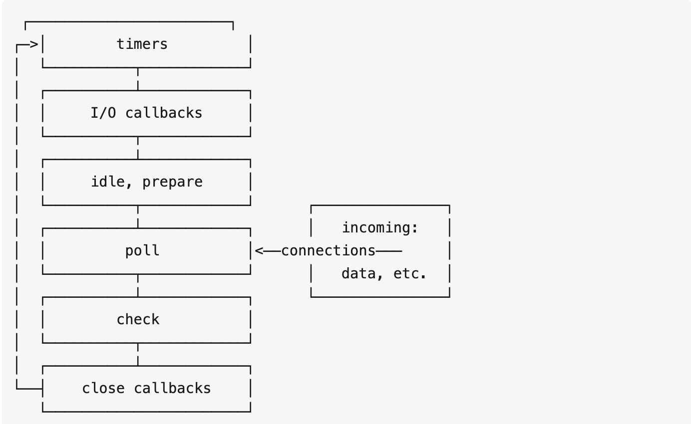

## 前言
经过上面的浏览器的事件循环学习，我们已经对事件循环基本有所理解，也接触到了宏任务和微任务，在阅读狼叔的过程中，发现node事件循环的实现是依靠的libuv引擎，和浏览器的事件循环有所不同
## Node中的事件循环
node中的事件循环模型是这样的

从模型中，我们可以大致对node中的事件循环的顺序有个大概的了解： 
输入数据-->轮询阶段(poll)-->检查阶段(check)-->关闭事件回调阶段(close callback)-->定时器检测阶段(timer)-->I/O事件回调阶段(I/O callbacks)-->闲置阶段(idle, prepare)-->轮询阶段.下面来详细的了解下各个阶段的工作。
## 阶段概述
- timers(定时器检测阶段)：本阶段执行 timer 的回调，即 setTimeout、setInterval 里面的回调函数。
- I/O callbacks(I/O事件回调阶段)：执行几乎所有的回调。执行延迟到下一个循环迭代的 I/O 回调，即上一轮循环中未被执行的一些I/O回调。
- idle, prepare(闲置阶段)：仅系统内部使用。
- poll(轮询阶段)：检索新的i/o事件,node可能会阻塞在这个阶段
- check(检查阶段)：setImmediate()回调函数在这个阶段执行
- close callback(关闭事件回调阶段)：例如socket.on('close', ...)一些关闭的回调函数
## poll阶段
这个阶段可以说是比较重要的阶段，当代码被传入libuv引擎后，循环会首先进入poll阶段。  
poll会先查看poll queue中是否有事件，有任务就按先进先出的顺序依次执行回调。 当queue为空时，会检查是否有setImmediate()的callback，如果有就进入check阶段执行这些callback。但同时也会检查是否有到期的timer，如果有，就把这些到期的timer的callback按照调用顺序放到timer queue中，之后循环会进入timer阶段执行queue中的 callback。 这两者的顺序是不固定的，收到代码运行的环境的影响。如果两者的queue都是空的，那么loop会在poll阶段停留，直到有一个i/o事件返回，循环会进入i/o callback阶段并立即执行这个事件的callback。
## node和浏览器中事件循环的区别
两者最主要的区别在于浏览器中的微任务是在每个相应的宏任务完成后执行的，而node中的微任务是在不同阶段之间执行的。