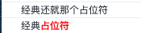

<!-- ## 在掘金上发现的小技巧 -->

### 使用占位符

```js
// %s 字符串占位符
console.log('经典%s占位符','还就那个');   
// %c css格式字符串
console.log('经典%c占位符','color:red;font-weight:bold;')
```




占位符列表：

| 占位符  | 功能    |
| :---: | :---: | 
| %s     | 字符串  | 
| %d     | 整数 | 
| %i     | 整数  | 
| %f     | 浮点数  | 
| %o     | 对象的链接| 
| %c     | css格式字符串| 